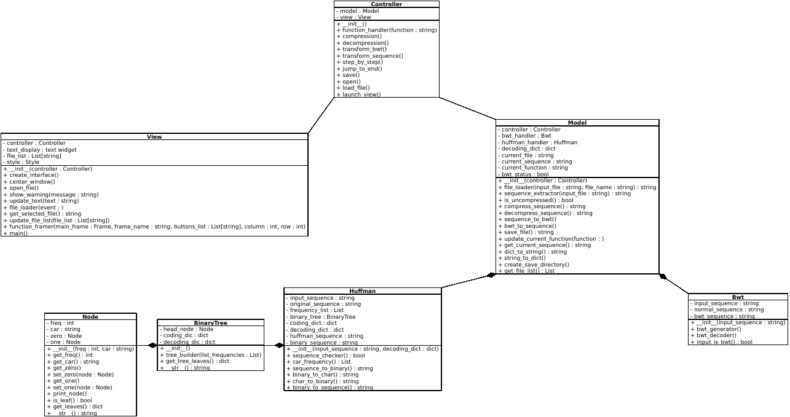

# dnashrink


[](https://forthebadge.com)
[](https://forthebadge.com)
[](https://forthebadge.com)
[](https://forthebadge.com)
[](https://forthebadge.com)
[](https://forthebadge.com)
[](https://forthebadge.com)
[](https://forthebadge.com)

- A Python implementation of ***The Burrows-Wheeler Transform (BWT)*** alongside ***Huffman compression*** on DNA sequences.
- Hosted on [GitHub](https://github.com/Ouertani95/PROJET_ALGO)

## Architecture

The dnashrink tool is based on the MVC architecture shown in the representation below:


### Scripts

This list represents all the scripts that are part of the dnashrink package:
- **__init__** : script for initializing the dnashrink folder and it's modules as a package
- **main** : entry point to launch the dnashrink interface
- **controller** : the brains of the program controlling both the view and model logics
- **view** : the GUI of the program that interacts with the user and displays results
- **model** : the data flow manager that adds, modifies, removes and returns data
- **bwt** : bwt class responisble for the Burrows-Wheeler Transform and reverse Transform of DNA sequences
- **huffman** : huffman class responsible for the Huffman compression and decompression of DNA sequences
- **Binary_tree** : BinaryTree class used in the Huffman compression algorithm alongside Node class used for building the BinaryTree object


### UML

The following graph represents the UML visualization of all the classes and their corresponding attributes and methods as well as their interactions with one another:



## Installation

- You can install the package from the source code hosted on github.

```bash
mkdir ~/Desktop/OUERTANI/
cd ~/Desktop/OUERTANI/
git clone https://github.com/Ouertani95/PROJET_ALGO
sudo python3 setup.py install
```

## Getting started

- After installing the package from source, the interface can be launched simply from the command line:

```bash
dnashrink
```

- If problems occur with the installation, the interface can be launched the following way:

```bash
cd ~/Desktop/OUERTANI/PROJET_ALGO
python3 main.py
```

## Using the dnashrink tool

- Using a normal / decompressed sequence as input :
https://user-images.githubusercontent.com/95162533/158532608-5343de63-76a9-4c28-a879-1999f855b855.mp4

-Using a compressed Huffman sequence as input :
https://user-images.githubusercontent.com/95162533/158532650-e5603798-04e8-4a56-bc6c-59bd63aa35a6.mp4

## Authors :

**Mohamed Ouertani**


